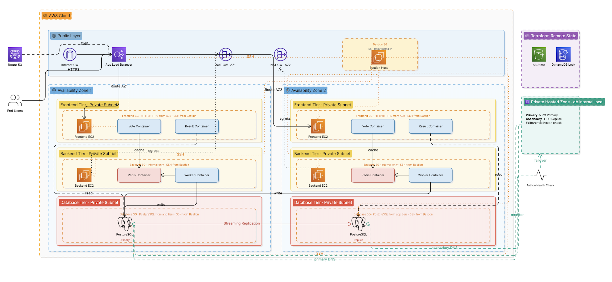

# 🚀 Multi-Stack DevOps Infrastructure Automation
**Production-style AWS infrastructure with Terraform, Ansible, Docker, and PostgreSQL high availability**

---

## 🌿 Branch Strategy

This repository contains **two deployment approaches**:

- **`main` branch** → Single-AZ deployment (baseline architecture for standard application deployment)
- **`feature/ha-design` branch** → Full **High Availability (HA)** deployment:
  - Multi-AZ architecture across 2 Availability Zones
  - Application Load Balancer (ALB)
  - Route 53 private hosted zone failover
  - PostgreSQL primary-replica streaming replication
  - Bastion-hosted health monitoring

> ⚠️ For enterprise-grade deployment, use the **`feature/ha-design`** branch.

---

## 🏗️ Architecture Diagram




# Architecture Summary

## Core Components

### Public Layer

* **Bastion Host**

  * Secure SSH entry point
  * Centralized Ansible controller
  * Route 53 health-check host

* **Application Load Balancer (ALB)**

  * Routes `/vote` traffic to frontend vote service
  * Routes `/result` traffic to frontend result service
  * Distributes traffic across two Availability Zones

* **Internet Gateway**

  * Public internet access for bastion and ALB

---

### Private Layer

* **2 Frontend EC2 Instances**

  * One per AZ
  * Dockerized vote + result applications

* **2 Backend EC2 Instances**

  * One per AZ
  * Redis + worker services

* **2 PostgreSQL Database Nodes**

  * Primary database
  * Replica database with streaming replication

* **2 NAT Gateways**

  * Internet access for private instances
  * Package/image downloads

---

# High Availability Features

## PostgreSQL Replication

* Primary handles writes
* Replica handles failover/read scenarios
* Streaming replication configured with `pg_basebackup`

## Route 53 Failover

* Private hosted zone DNS endpoint (`db.internal.local`)
* Primary DNS record → Primary DB
* Secondary DNS record → Replica DB
* Bastion-hosted Python health check validates primary availability

## Application Resilience

* Backend services connect via DNS endpoint
* Failover possible without backend reconfiguration

---

## 🧰 Tech Stack


---

## 📦 Prerequisites

Ensure the following tools are installed before deployment:

### Required Software

- Terraform >= 1.x
- Ansible
- Docker
- Docker Compose
- AWS CLI
- Python 3
- SSH Key Pair
- Git

### AWS Requirements

- AWS Account
- IAM credentials configured (`aws configure`)
- EC2 Key Pair
- Sufficient permissions for:
  - VPC
  - EC2
  - Route53
  - S3
  - DynamoDB
  - ALB
  - NAT Gateway

---

## 💻 Run Locally

For local containerized deployment:

```bash
docker-compose up --build
```

## Local Access

- Vote App → `http://localhost:8080`
- Result App → `http://localhost:8081`

---

# ☁️ Deploy to AWS (Zero-Context Step-by-Step)

## Step 1 — Clone Repository

```bash
git clone https://github.com/lananhtrande/Project-1-Multi-Stack-DevOps-Infrastructure-Automation.git
cd Project-1-Multi-Stack-DevOps-Infrastructure-Automation
git checkout feature/ha-design
```

---

## Step 2 — Bootstrap Terraform Remote Backend

```bash
cd terraform-miniproject/terraform-bootstrap
terraform init
terraform apply
```

### This provisions:

- S3 bucket for Terraform remote state
- DynamoDB table for state locking

---

## Step 3 — Deploy Core Infrastructure

```bash
cd terraform-miniproject
terraform init
terraform apply
```

### Infrastructure Created

- VPC
- Public subnets
- Private subnets
- Internet Gateway
- NAT Gateways
- Bastion host
- Frontend EC2 nodes
- Backend EC2 nodes
- PostgreSQL primary node
- PostgreSQL replica node
- Security groups
- Application Load Balancer (HA branch)
- Route53 private hosted zone (This is done via AWS console)

---

## Step 4 — Update Security Groups

### Bastion Host Security Group

⚠️ **IMPORTANT:**

Modify inbound SSH rule:

- Replace placeholder IP with **your PC’s public IP address**
- OR use `0.0.0.0/0` for open access (not recommended)

### Example:

```text
Port: 22
Protocol: TCP
Source: YOUR_PUBLIC_IP/32
```

---

## Step 5 — Configure Ansible Inventory

Populate inventory with:

- Backend private IPs
- PostgreSQL node IPs

Before running Ansible playbooks, configure your local SSH client to securely access private EC2 instances through the Bastion host using `ProxyJump`.

### Edit SSH Configuration

Open your SSH config file:

```bash
nano ~/.ssh/config
```

---

### Add Configuration

```ssh
# Configure bastion instance
Host bastion
    HostName <bastion-public-ip>
    User ubuntu
    IdentityFile ~/.ssh/<key-pair-name>.pem

# Frontend Node AZ1
Host frontend-1
    HostName <frontend-private-ip-az1>
    User ubuntu
    IdentityFile ~/.ssh/<key-pair-name>.pem
    ProxyJump bastion

# Frontend Node AZ2
Host frontend-2
    HostName <frontend-private-ip-az2>
    User ubuntu
    IdentityFile ~/.ssh/<key-pair-name>.pem
    ProxyJump bastion

# Backend Node AZ1
Host backend-1
    HostName <backend-private-ip-az1>
    User ubuntu
    IdentityFile ~/.ssh/<key-pair-name>.pem
    ProxyJump bastion

# Backend Node AZ2
Host backend-2
    HostName <backend-private-ip-az2>
    User ubuntu
    IdentityFile ~/.ssh/<key-pair-name>.pem
    ProxyJump bastion

# PostgreSQL Primary
Host postgres-primary
    HostName <postgres-primary-private-ip>
    User ubuntu
    IdentityFile ~/.ssh/<key-pair-name>.pem
    ProxyJump bastion

# PostgreSQL Replica
Host postgres-replica
    HostName <postgres-replica-private-ip>
    User ubuntu
    IdentityFile ~/.ssh/<key-pair-name>.pem
    ProxyJump bastion
```

---

### Secure SSH Config Permissions

```bash
chmod 600 ~/.ssh/config
chmod 400 ~/.ssh/<key-pair-name>.pem
```

---

### Test SSH Connectivity

```bash
ssh bastion
ssh frontend-1
ssh backend-1
ssh postgres-primary
```

---

## Step 6 — Install Base Dependencies

```bash
ansible-playbook install-docker.yml
```

---

## Step 7 — Deploy PostgreSQL High Availability

Before deploying PostgreSQL, define group_vars/pg.yml

```bash
pg_version: "14"
pg_data_dir: "/var/lib/postgresql/14/main"
pg_conf_dir: "/etc/postgresql/14/main"
replication_user: "replicator"
replication_password: "<replication password>"
pg_port: 5432
ansible_user: ubuntu
```

```bash
ansible-playbook -i inventory.yml install-postgres.yml
ansible-playbook -i inventory.yml configure-primarypg.yml
ansible-playbook -i inventory.yml configure-replicapg.yml
ansible-playbook -i inventory.yml verify-replicapg.yml
```

### Configures:

- PostgreSQL primary
- Replication user
- `postgresql.conf`
- `pg_hba.conf`
- Streaming replication
- Replica bootstrap via `pg_basebackup`

---

## Step 8 — Deploy Backend Services

```bash
ansible-playbook -i inventory.yml deploy-backend.yml
```

### Deploys:

- Redis container
- Worker container
- Dynamic DB DNS endpoint integration

---

## Step 9 — Deploy Frontend Services

```bash
ansible-playbook -i inventory.yml deploy-frontend.yml
```

### Deploys:

- Vote container
- Result container

---

## Step 10 — Start Route53 Health Check

Run on Bastion (copy health.py to bastion):

```bash
ssh bastion
sudo python3 health.py
```

### Health Check Logic

- Validates PostgreSQL primary on port 5432
- HTTP 200 = healthy
- HTTP 500 = unhealthy

---

# ⚙️ Environment Variables

(Example in .env.example)

---

# 🔄 Operational Flow

## Normal Workflow

1. User submits vote through Vote app  
2. Vote stored in Redis queue  
3. Worker consumes vote  
4. Worker writes to PostgreSQL primary  
5. Result app queries PostgreSQL  
6. ALB distributes frontend traffic  

---

## Failure Workflow

1. PostgreSQL primary becomes unavailable  
2. Bastion health check detects failure  
3. Route53 failover triggers  
4. DNS points `db.internal.local` to replica  
5. Replica promoted manually  
6. Services reconnect using DNS  

---

# 🔐 Security Design

## Bastion Host

- SSH from trusted IP only
- HTTP from anywhere (for health check)
- Centralized administration

## Frontend Tier

- HTTP/HTTPS from ALB only
- SSH only from Bastion

## Backend Tier

- Redis from Frontend
- SSH only from Bastion

## Database Tier

- PostgreSQL only from application security groups
- SSH only from Bastion

---

# ⚠️ Known Issues / Limitations

## ❗ Manual Promotion

When the primary database fails:

- Replica requires **manual promotion**
- No automated failover orchestration
- Recovery process increases operational risk

---

## 🔧 Improvement Needed

Implement:

- Patroni
- repmgr
- Automated leader election
- Automatic failover
- Self-healing replication

---

## 🚀 Recommended Future State

Using **Patroni** would provide:

- Automatic failover
- Automatic replica promotion
- Distributed consensus
- Reduced downtime
- Improved resilience

---

# 🚀 Future Improvements

- Patroni automated failover
- PgBouncer / HAProxy
- Prometheus monitoring
- Grafana dashboards
- CloudWatch alerts
- CI/CD integration
- Kubernetes migration
- Auto-scaling
- Automated failback
- Blue/Green deployment strategy

---

# 💼 Skills Demonstrated

- AWS Cloud Architecture
- Infrastructure as Code (Terraform)
- Configuration Management (Ansible)
- Dockerized Deployments
- PostgreSQL Replication
- High Availability Engineering
- Disaster Recovery Design
- DNS Failover Automation
- Linux Administration
- DevOps Best Practices

---

# 👨‍💻 Author(s)

**Diogo Barros**
- Core project

**Lan Anh Tran**

- Multi-Stack DevOps Infrastructure Automation (AWS, Terraform, Ansible, Docker)
- LinkedIn: https://www.linkedin.com/in/tran-lan-anh-12019681/
- GitHub: https://github.com/lananhtrande

---

# 🏁 Conclusion

This project serves as a practical example of **enterprise-grade DevOps engineering**, integrating:

- Cloud networking
- Secure infrastructure
- Infrastructure automation
- Configuration management
- Container orchestration
- Database replication
- DNS failover
- Operational resilience

## Final Outcome

A scalable, secure, automated, production-style deployment platform suitable for:

- Portfolio demonstration
- DevOps interviews
- Infrastructure engineering showcases
- Cloud modernization projects

---

# ⭐ Repository Highlights

✔ Single-AZ deployment option  
✔ Full HA Multi-AZ architecture  
✔ Bastion-managed infrastructure  
✔ PostgreSQL replication  
✔ Route53 failover  
✔ Dockerized applications  
✔ Modular Terraform structure  
✔ Automated Ansible deployment  
✔ Production-focused design principles  
